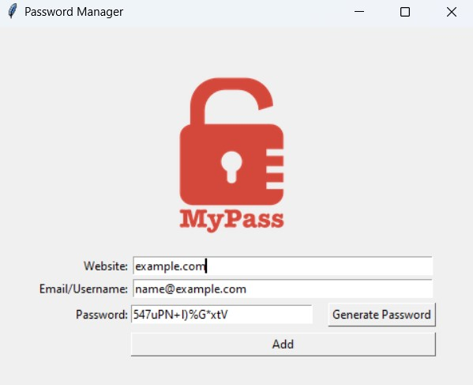

# Password Manager - Python GUI Application Version 2.0

This is a simple password manager application built using Python and the Tkinter library. It allows users to generate secure passwords and store their website login details in a text file.

## Features

- Generate strong passwords consisting of letters (both upper and lower case), numbers, and symbols.
- Store website login details (website URL, email/username, and password) in a local text file.
- User-friendly graphical user interface (GUI) built with Tkinter.

## Screenshots



## Getting Started

Follow the steps below to run the Password Manager application on your local machine:

1. Clone the repository:

```bash
git clone https://github.com/ssalidm/password-manager.git
```

2. Navigate to the project directory:

```bash
cd password-manager
```

3. Install the required packages (make sure you have Python installed):

```bash
pip install -r requirements.txt
```

4. Run the application:

```bash
python main.py
```

## How to Use

1. Launch the Password Manager application using the steps provided above.

2. **Generate Password:** Click on the "Generate Password" button to create a secure password. The generated password will be automatically filled in the password input field.

3. **Save Website Details:** Enter the website URL, email/username, and password in the corresponding input fields. Click on the "Add" button to save the website details in a local text file named "data.txt."

4. **Exit:** Close the application by clicking the "x" button on the window's title bar.

## Contributing

Contributions are welcome! If you find any bugs or want to add new features, feel free to create an issue or submit a pull request.

## License

This project is licensed under the [MIT License](https://github.com/ssalidm/password-manager/blob/main/LICENSE).

## Acknowledgments

- This project was inspired by the [App Brewery's](https://www.appbrewery.co/) Python course on Udemy.
