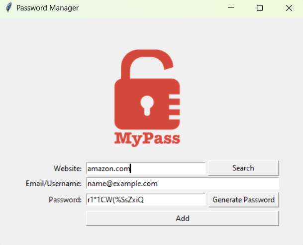

# Password Manager

This simple Password Manager application is built using Python's `tkinter` library and allows you to generate, save, and retrieve passwords for various websites. Keep your login credentials organized and secure with this user-friendly tool!

## Features

1. **Password Generator:** Generate strong and secure passwords with a combination of letters (lowercase and uppercase), numbers, and symbols.

2. **Save Passwords:** Store website URLs, corresponding email/usernames, and passwords securely in a local data file.

3. **Search Functionality:** Easily find and retrieve your saved passwords by searching for the website URL.

## How to Use

1. **Generate Password:** Click the "Generate Password" button to create a strong password that you can use for your new accounts.

2. **Add New Entry:** Fill in the "Website," "Email/Username," and "Password" fields. Then click the "Add" button to save the entry securely in the data file.

3. **Retrieve Password:** To retrieve a saved password, enter the website URL in the "Website" field and click the "Search" button. If the entry exists, the application will display the website, email/username, and password.

## Dependencies

- Python 3.x
- tkinter (should come pre-installed with most Python distributions)
- pyperclip

## Getting Started

1. Clone the repository to your local machine.
2. Make sure you have Python 3.x installed.
3. Install the required dependencies (if not already installed).
```
pip install -r requirements.txt
```
4. Run the application using the following command:

```
python3 password_manager.py
```

## Screenshot



## Note

This application saves your data locally in a file called "data.json" in the same directory as the script. Keep this file secure and avoid sharing it with others.

**Caution:** While this application can help you manage your passwords, it is essential to remain cautious and use additional security measures, such as two-factor authentication, for sensitive accounts.

Enjoy a more organized and secure online experience with this Password Manager! If you encounter any issues or have suggestions for improvement, feel free to reach out. Happy coding!

## License

This project is licensed under the [MIT License](https://github.com/ssalidm/password-manager/blob/main/LICENSE).

## Acknowledgments

- This project was inspired by the [App Brewery's](https://www.appbrewery.co/) Python course on Udemy.